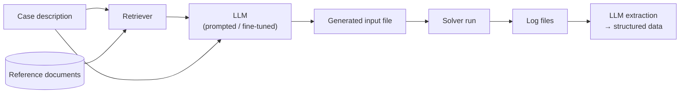

# LLMs and NLP

!!! abstract "In one minute"
    - **Problem.** Scientific and operational workflows are full of unstructured text: solver
      logs, input decks, support tickets. People spend hours reading and writing them.
    - **What I built.** At LLNL: LLM pipelines that turn simulation log files into structured
      data and automate solver input generation, using retrieval-augmented generation (RAG) and
      fine-tuning, and evaluated with RLHF. At AZX: a customer-support chatbot built with
      supervised fine-tuning (SFT) and RAG.
    - **Result.** LLMs working as parts of simulation workflows, not only as chat interfaces.

## LLMs for simulation workflows (LLNL)

Large simulation campaigns produce many log files and need many correct input files. I applied
transformer LLMs to both sides:

- **Log → structured data.** Using transformer LLMs to extract information from simulation
  log files into a structured format.
- **Input generation.** Automating solver input generation with LLM prompts, using RAG and
  fine-tuning.
- **Evaluation.** Comparing LLMs on both tasks, using RLHF and fine-tuning to improve them.

The pattern, in general form:

<em>Illustrative schematic of LLM-assisted input generation and log processing.</em>

## Support chatbot (AZX)

A first-line customer-support chatbot built with supervised fine-tuning (SFT) and
retrieval-augmented generation (RAG).

## Toolkit

| Area | Tools and methods |
|---|---|
| Models | Transformers, BERT, RoBERTa, T5, GPT, Claude, OpenAI platform, VLMs |
| Adaptation | SFT, LoRA / PEFT, RLHF, PPO, DPO |
| Retrieval | RAG, LlamaIndex, Pinecone, ChromaDB |
| Orchestration | LangChain, LangGraph, Flowise, MCP, agents |
| Platform | Hugging Face, PyTorch, AWS SageMaker, MLflow, Docker |

Coursework and experiments: [RAG agents with LLMs (NVIDIA DLI)][rag-agents-repo].

## Stack

PythonPyTorchHugging FaceLangChain / LangGraphRAGSFT / LoRARLHF / DPOVector DBs
