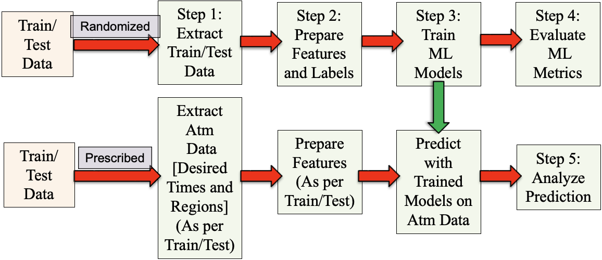
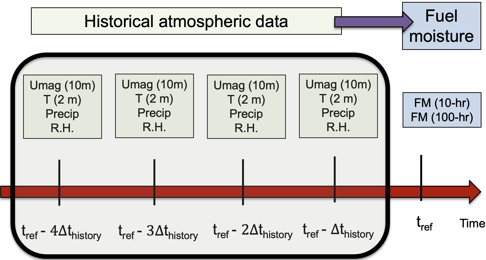
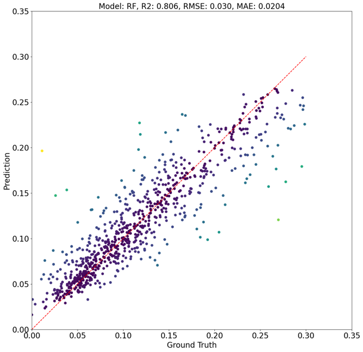
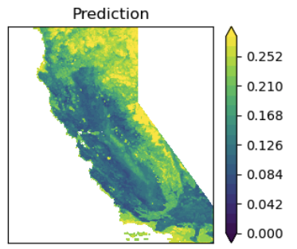
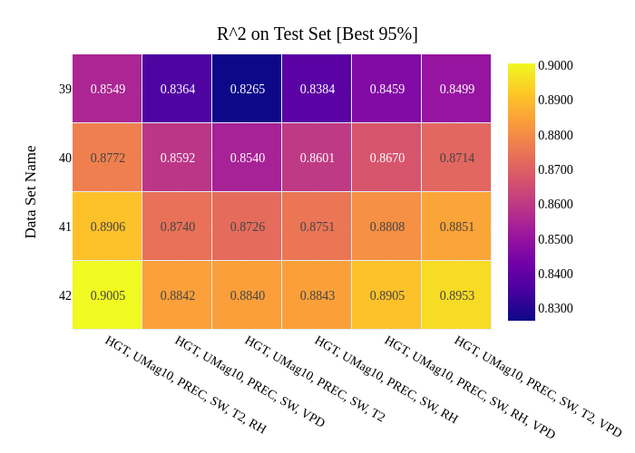

# Surrogate Modeling and Physics AI

!!! abstract "In one minute"
    - **Problem.** Transport-based models of wildfire fuel moisture are accurate but too
      expensive to run for the many scenarios that risk planning needs.
    - **What I built.** **MLAP**, the Machine Learning Automation Pipeline, at LLNL. It learns
      fuel moisture from the *history* of atmospheric conditions, trained on **8 TB of
      reanalysis data (21 years, hourly, 3 km)** over California. Every stage runs from a JSON
      file, so large parametric studies need no code edits.
    - **Result.** Released as open source on [DOE OSTI][osti-mlap] and
      [LLNL's GitHub][llnl-mlap] (sole developer). Random forest reaches **R² ≈ 0.89** on
      held-out data. Hundreds of simulated cases show which data, history and variables actually
      matter.

<a class="badge" href="https://www.osti.gov/biblio/code-157408">OSTI code-157408</a>
<a class="badge" href="https://github.com/LLNL/MLAP">github.com/LLNL/MLAP</a>
<a class="badge" href="https://pkjha-aero.github.io/Wildfire_ML/">Full documentation</a>

## My role

I architected and wrote MLAP at LLNL, ran the parametric studies, and wrote up the
method ([manuscript, PDF][pdf-mlap-paper]). The code is MIT-licensed; its public documentation
is at [pkjha-aero.github.io/Wildfire_ML][wildfire-ml-docs].

## The pipeline

<figure markdown>

<figcaption>MLAP stages. The upper path trains on randomized samples. The lower path applies a
trained model to prescribed times and regions to produce fuel maps. From the
<a href="https://pkjha-aero.github.io/Wildfire_ML/">MLAP documentation</a>.</figcaption>
</figure>

| Step | What it does |
|---|---|
| 1 · Extract | Subsample the 21-year dataset over chosen times and grid points |
| 2 · Prepare | Build features from the *history* of atmospheric drivers, plus regression or classification labels |
| 3 · Train | Scale, split, fit (random forest, MLP, gradient boosting and others), compute metrics |
| 4 · Evaluate | Compare many dataset × label × model combinations as heatmaps and bar charts |
| 5 · Analyze / Predict | Apply a chosen model at the desired time and region to generate fuel-moisture maps |

<figure markdown>

<figcaption>Features come from the history of atmospheric drivers (wind, temperature,
humidity, precipitation, shortwave flux) before each reference time. The physics of dead-fuel
moisture is a lagged response. From the MLAP documentation.</figcaption>
</figure>

## What the studies showed

- **Random forest beats MLP** on identical data: R² ≈ 0.89 vs 0.79. Most hyperparameters barely
  matter; two dominate (random forest `bootstrap`, MLP `solver`).
- **Spatial and temporal sampling behave differently.** More grid points help; more reference
  times do not.
- **Shortwave downward flux matters far more than precipitation.** Vapor-pressure deficit does
  not replace temperature and humidity without loss.
- **Returns on longer history are small:** about 1% R² for 50% more history.

<figure markdown>

<figcaption>Predicted vs. reference fuel moisture on held-out data.</figcaption>
</figure>

<figure markdown>

<figcaption>A fuel-moisture map over California generated by a trained model.</figcaption>
</figure>

<figure markdown>

<figcaption>Step 4 turns a parametric study into one picture: R² across dataset and model
configurations.</figcaption>
</figure>

**Built for wildfire, designed more generally.** MLAP relates a target variable to the history
of its drivers on a space-time grid. Other atmospheric problems with that shape can reuse it
by changing the variables, not the code.

## Earlier: CFD surrogates at Envision Digital

At Envision Digital (2017–2019) I trained a suite of ML models on CFD simulation data of flow
over complex terrain. The surrogates replaced solver runs in wind-resource assessment with a
**10× speed-up**. I also made the underlying RANS/DES solver 30% faster. That is the same pattern
as MLAP at a different scale: an expensive physics model generates the training data, and a
verified surrogate answers the many-scenario questions.

## Related ML at LLNL

- An MLP classifier of wildfire fuel type from satellite imagery
- Geospatial data selection and model performance across California regions
- Data pipelines with NetCDF, GRIB, Xarray, Dask, GDAL and Rasterio on HPC

## Stack

Pythonscikit-learnPyTorchPandas / NumPyXarray / DaskNetCDF / GRIBGDAL / RasterioJSON-driven pipelinesSlurm

## Links

- DOE OSTI: [MLAP, code-157408][osti-mlap] · LLNL GitHub: [LLNL/MLAP][llnl-mlap]
- Docs: [pkjha-aero.github.io/Wildfire_ML][wildfire-ml-docs] · Repo: [pkjha-aero/Wildfire_ML][wildfire-ml-repo]
- Manuscript: [MLAP and wildfire fuel moisture (PDF)][pdf-mlap-paper] · [Machine Learning folder][drive-ml]
