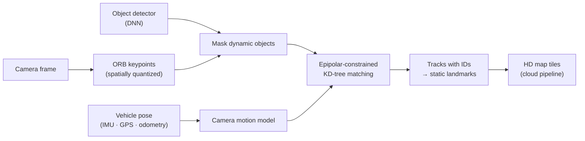

# Computer Vision and ADAS

!!! abstract "In one minute"
    - **Problem.** Fleet cameras and sensors must detect hazards and build maps in real time, on
      low-power edge devices, for customers who judge the product by accuracy in the field.
    - **What I built.** At NetraDyne: keypoint and object detection and tracking in C++ for
      in-vehicle devices, an IMU + GPS **collision-prediction** model, and the HD maps
      pipeline for autonomous driving as its lead developer. At AZX: satellite-image
      **solar-panel detection** and **DER detection** for electric utilities.
    - **Result.** Code deployed to **100,000+ devices**. Collision prediction at **>95%
      accuracy** secured a deal to equip Amazon delivery vans. HD maps ran on Motional (Hyundai
      Aptiv) test cars and supported a **$10M investment from Hyundai**.

!!! note "About this page"
    NetraDyne and AZX code is proprietary. This page describes approaches in general terms.
    Diagrams are schematics drawn for this site; no customer imagery or source code is shown.

## NetraDyne (2019–2020): Staff Engineer, CV, robotics and ML

### Keypoint detection and tracking on the device

The HD maps effort needed stable landmarks from a moving vehicle's camera, computed on the
device itself. I built the device-side detection-and-tracking engine in C++:

- **Keypoints.** ORB features with spatial quantization, so landmarks spread across the frame.
  Keypoints on moving objects (cars, pedestrians) are rejected using the object detector's
  boxes.
- **Matching.** KD-tree nearest-neighbour search with a ratio test, constrained by
  **epipolar geometry** from a camera-motion model driven by vehicle poses.
- **Tracking.** Tracks carry unique IDs, with length limits that discard short-lived false
  detections. Keypoints are associated with detected objects.
- **Calibration.** DNN-based tracking of objects and lane lines, with camera calibration
  refined by gradient-descent optimization.
- **Engineering.** Ported from a Python prototype to C++ (OpenCV, Eigen), with CMake builds
  for embedded ARM targets.

<em>Schematic of the device-side landmark pipeline (drawn for this site).</em>

### HD maps for autonomous driving

I was lead developer of the HD maps software. The work involved processing sensor data
(IMU, GPS, camera, odometer) from ground vehicles and fusing it with Kalman filtering. The wider
system covered pose estimation, GNSS processing, map-tile updates and map-quality KPIs. The
maps were deployed to Motional (Hyundai Aptiv) autonomous test cars.

### Collision prediction from IMU and GPS

Fleet devices must raise an alert when a vehicle is in a collision, and must not raise one on
potholes or hard braking. I developed the event-detection models from inertial and GPS data:

- Engineered features from low-g acceleration events
- A heuristic detector and an **SVM classifier**, compared on labeled alert data
- Productized as an API with pytest coverage and cloud-hosted models

**>95% accuracy.** The model became part of the deal to install NetraDyne devices in
**100k+ Amazon delivery vans**.

## AZX (2024–present): Staff ML Engineer

Computer vision for the electric grid:

- **Solar-panel detection from satellite imagery** (YOLO, RT-DETR), to estimate
  distributed generation for grid-load assessment
- **Behind-the-meter DER detection** using wavelet analysis and deep learning
- Delivered for utilities including Puget Sound Energy, Con Edison and Trilliant

## LLNL: vision for the lab

An object detection and tracking tool for lab equipment, built with YOLO.

## Stack

C++OpenCVEigenCUDAPythonTensorFlowPyTorchYOLO / RT-DETRscikit-learn (SVM)Kalman filteringSLAMIMU / GPSDockerAWSQGIS

## Related

- [Foundations](../foundations.md): the linear algebra and estimation theory behind tracking
  and sensor fusion
- [Skills matrix](../skills.md)
