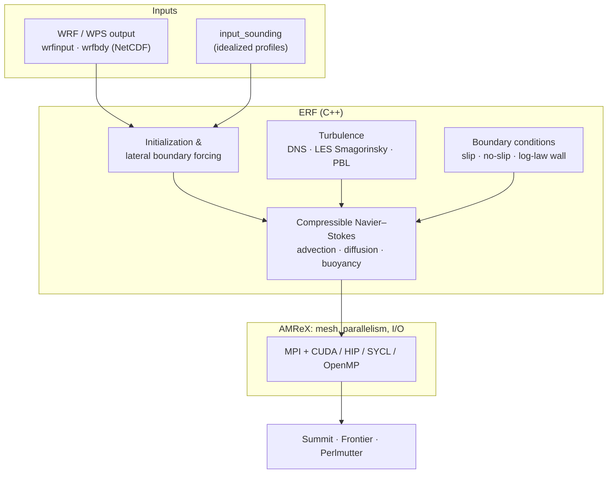

# ERF: GPU Exascale Atmospheric Modeling

!!! abstract "In one minute"
    - **Problem.** DOE needed a modern atmospheric model that runs on exascale GPU machines and
      bridges regional weather (mesoscale) and wind-plant turbulence (microscale). Legacy
      Fortran weather codes were not designed for GPUs.
    - **What I built.** I architected the core compressible Navier–Stokes solver of the
      **Energy Research and Forecasting (ERF)** model in C++/CUDA on AMReX, led LLNL's
      development team, and wrote the pipeline that starts ERF from real weather data (WRF/WPS).
    - **Result.** Open-source code released through DOE OSTI and published in JOSS. About 10×
      faster than traditional codes, run on ~50k cores of Summit, Frontier and Perlmutter. It
      led to **$15M in follow-up NNSA projects**.

<a class="badge" href="https://www.osti.gov/biblio/code-109687">OSTI code-109687</a>
<a class="badge" href="https://www.osti.gov/biblio/1998622">OSTI 1998622 · JOSS</a>
<a class="badge" href="https://github.com/erf-model/ERF">github.com/erf-model/ERF</a>

## My role

Staff scientist at **Lawrence Livermore National Laboratory** (2020–2024), and one of the first
developers of ERF. It is a DOE Wind Energy Technologies Office project across LBNL, NREL, LLNL
and ANL, with 6+ institutions involved. I led LLNL's part: strategy and development of the core
GPU solver. I'm a named developer on the [OSTI software record][osti-erf-code] and a co-author of
the [JOSS paper][doi-joss-2023].

## What ERF is

A fully compressible, non-hydrostatic atmospheric model for dry or moist air. Its features
include:

- PBL (MYNN) and LES (Smagorinsky, Deardorff) turbulence closures
- a third-order Runge–Kutta integrator with acoustic sub-stepping
- the Arakawa C-grid
- terrain-following coordinates
- microphysics

It is built on **AMReX** for block-structured adaptive mesh refinement and MPI+X parallelism,
where X is OpenMP on CPUs or CUDA / HIP / SYCL on GPUs.

## My contributions

**59 merged pull requests** from January 2021 to July 2022
([full list][erf-prs]), in four groups. Each item links to its pull requests.

### Core solver architecture

- The Navier–Stokes code architecture used by the rest of the team. [#20](https://github.com/erf-model/ERF/pull/20)
- Advection, and momentum, thermal and scalar diffusion, on the new architecture. [#25](https://github.com/erf-model/ERF/pull/25) · [#26](https://github.com/erf-model/ERF/pull/26)
- Energy and scalar diffusion in the compressible equations, and the deviatoric strain-rate tensor. [#110](https://github.com/erf-model/ERF/pull/110) · [#253](https://github.com/erf-model/ERF/pull/253)
- An equation-of-state fix, and a DNS implementation checked on the Taylor–Green vortex and other problems. [#29](https://github.com/erf-model/ERF/pull/29) · [#27](https://github.com/erf-model/ERF/pull/27)
- Pressure-gradient forcing of the momentum update, and an option to turn off gravity. [#115](https://github.com/erf-model/ERF/pull/115) · [#24](https://github.com/erf-model/ERF/pull/24)

### Turbulence and boundary layers

- The LES Smagorinsky model for momentum, with a sign fix for the eddy viscosity. [#47](https://github.com/erf-model/ERF/pull/47) · [#100](https://github.com/erf-model/ERF/pull/100)
- Slip and no-slip boundary conditions, and the **log-law wall** condition. [#51](https://github.com/erf-model/ERF/pull/51) · [#55](https://github.com/erf-model/ERF/pull/55)
- The atmospheric boundary-layer (ABL) driver. [#63](https://github.com/erf-model/ERF/pull/63)
- Channel-flow and ABL test cases, seeded by initial perturbations. [#53](https://github.com/erf-model/ERF/pull/53) · [#56](https://github.com/erf-model/ERF/pull/56)

### Real-weather initialization

This is what lets ERF start from an actual forecast.

- The **WPS–ERF interface**. [#382](https://github.com/erf-model/ERF/pull/382)
- Initialization from real meteorological data (`wrfinput`), with fixes for refinement levels and density perturbations. [#442](https://github.com/erf-model/ERF/pull/442) · [#524](https://github.com/erf-model/ERF/pull/524) · [#568](https://github.com/erf-model/ERF/pull/568) · [#575](https://github.com/erf-model/ERF/pull/575)
- Initialization from idealized data and from `input_sounding`, and the refactor that separates initialization types. [#393](https://github.com/erf-model/ERF/pull/393) · [#457](https://github.com/erf-model/ERF/pull/457) · [#455](https://github.com/erf-model/ERF/pull/455) · [#566](https://github.com/erf-model/ERF/pull/566)
- Reading WRF lateral boundary data (`wrfbdy`): time stamps, pressure, and density from potential temperature. [#446](https://github.com/erf-model/ERF/pull/446) · [#461](https://github.com/erf-model/ERF/pull/461) · [#553](https://github.com/erf-model/ERF/pull/553) · [#558](https://github.com/erf-model/ERF/pull/558) · [#559](https://github.com/erf-model/ERF/pull/559) · [#561](https://github.com/erf-model/ERF/pull/561) · [#563](https://github.com/erf-model/ERF/pull/563) · [#564](https://github.com/erf-model/ERF/pull/564)
- Reorganized NetCDF I/O for WPS/WRF files. [#525](https://github.com/erf-model/ERF/pull/525)
- Case setups: Chisholm View (a real mesoscale case), Ekman spiral variants, Witch of Agnesi, uniform-advection tests. [#403](https://github.com/erf-model/ERF/pull/403) · [#570](https://github.com/erf-model/ERF/pull/570) · [#456](https://github.com/erf-model/ERF/pull/456) · [#208](https://github.com/erf-model/ERF/pull/208)

### Quality and documentation

- The **regression-test** framework and its documentation. [#68](https://github.com/erf-model/ERF/pull/68) · [#199](https://github.com/erf-model/ERF/pull/199) · [#204](https://github.com/erf-model/ERF/pull/204)
- Documentation of the Euler and Navier–Stokes discretization on the Arakawa C-grid, and of stress–strain theory. [#6](https://github.com/erf-model/ERF/pull/6) · [#95](https://github.com/erf-model/ERF/pull/95) · [#154](https://github.com/erf-model/ERF/pull/154) · [#214](https://github.com/erf-model/ERF/pull/214)
- Documentation of real-data and `input_sounding` initialization. [#400](https://github.com/erf-model/ERF/pull/400) · [#443](https://github.com/erf-model/ERF/pull/443) · [#476](https://github.com/erf-model/ERF/pull/476)
- Build fixes with terrain enabled, AMReX update, and code clean-ups. [#509](https://github.com/erf-model/ERF/pull/509) · [#7](https://github.com/erf-model/ERF/pull/7) · [#1](https://github.com/erf-model/ERF/pull/1) · [#16](https://github.com/erf-model/ERF/pull/16) · [#117](https://github.com/erf-model/ERF/pull/117) · [#248](https://github.com/erf-model/ERF/pull/248) · [#477](https://github.com/erf-model/ERF/pull/477)

## Coupling across scales

Before ERF could couple mesoscale and microscale runs natively, I studied the problem with WRF-LES
and generalized actuator disks. I presented this work as first author at the AMS Annual Meeting
2023, with NREL, Virginia Tech and DTU co-authors. It also fed DOE's multi-lab lessons-learned
paper ([Haupt et al., WES 2023][doi-wes-2023]).

<figure markdown>

<figcaption>Alpha Ventus offshore case, WRF-LES with a generalized actuator disk: 10-minute
average hub-height wind speed without (left) and with (right) the cell perturbation method
(CPM). CPM seeds realistic turbulence at the nest boundary, so the wake meanders and recovers
realistically instead of staying laminar. Jha et al., AMS 2023
(<a href="https://drive.google.com/file/d/1l0e13PglAMt-zR0Oen8r6yfPV-NlAlJt/view">slides</a>,
LLNL-PRES-843772).</figcaption>
</figure>

## Who it serves

Weather intelligence for drones, aircraft, helicopters, ships and wind farms, and nuclear
dispersion in microscale weather. ERF is now the basis for further atmospheric-physics
components (radiation, land-surface models) in DOE programs.

## Stack

C++CUDAAMReXMPIOpenMPNetCDFWRF / WPSLES / PBLRegression testingSphinxSummit · Frontier · Perlmutter

## Links

- Code: [github.com/erf-model/ERF][erf-repo] · [my merged PRs][erf-prs]
- DOE OSTI: [software record code-109687][osti-erf-code] · [JOSS record 1998622][osti-erf-joss] ·
  [OSTI software record (PDF)][pdf-osti-erf]
- Papers: [JOSS 2023][doi-joss-2023] ([PDF][pdf-joss-2023]) · [WES 2023][doi-wes-2023]
  ([PDF][pdf-wes-2023]) · [AMS 2023 slides][pdf-ams-2023]
- All: [Atmosphere & mesoscale folder][drive-atmosphere]
