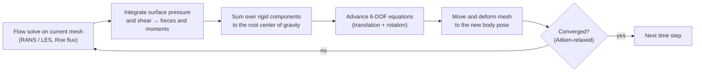

# Submarine Maneuvering: Fluid–6-DOF Coupling

!!! abstract "In one minute"
    - **Problem.** Predicting how a submarine responds to its own maneuvers means solving the
      flow and the rigid-body motion *together*: the hull moves, the mesh moves, the loads change.
    - **What I built.** The fluid–6-DOF rigid-body coupling in HYDRO, a US Navy CFD code: a
      multi-component rigid-body system, forced and free motion, stable sub-iteration between
      flow and body, restart, and the regression-test suite that guarded all of it.
    - **Result.** A verified parallel C++/MPI capability for submarine maneuvering simulation,
      run on the ONR cluster at ~5k CPUs, delivered for the US Navy.

## My role

Research Scientist at CMSoft (2015–2017), a small company developing HYDRO for the US Navy. I extended my CFD work from rotors to underwater vehicles. I owned the
rigid-body dynamics, its coupling to the flow solver, restart, and the regression framework,
alongside the core HYDRO developers on a large C++ codebase.

!!! note "About this page"
    HYDRO is a US Navy code. This page describes the work in general terms only. The diagrams
    are schematics drawn for this site and contain no project geometry, data or source code.

## How the coupling works

Each physical time step alternates between the fluid and the body until the two agree:

**What I implemented:**

- **Rigid-body system.** Bodies built from multiple components (hull, appendages), each carrying
  its own forces, moments, points and reference frames. External loads are summed recursively
  to the root center of gravity.
- **Forced and free motion.** Prescribed maneuvers (for example pitching) for verification,
  and fully coupled free motion. Flow advance and mesh advance are kept separate so each mode
  stays consistent.
- **Stable coupling.** Sub-iterations with Aitken relaxation, so the fluid–body exchange
  converges without very small time steps.
- **Restart.** Full restart of coupled runs, including the rigid-body state and the motion
  history mapped to mesh degrees of freedom. On a shared cluster, long maneuvers depend on it.
- **Regression testing.** A CMake + Python suite of sample cases: steady and unsteady airfoils,
  a pitching airfoil, a cylinder, a 6-DOF airfoil, stratified flow, restart cases and
  axisymmetric hull benchmarks. New features were checked against it before merging.

## Verification and validation

Modules were checked first against classical fluid-dynamics problems with known answers, then
against submarine-specific cases. The same philosophy runs through my later work: the
[ERF regression tests](erf-exascale.md) and the evaluation stage of
[MLAP](../ai-ml/surrogate-modeling.md).

**Why it matters for the roles I target:** this is multi-physics coupling (fluid + structure
dynamics) in production-grade scientific C++, the building block of a digital twin of a
maneuvering vehicle. The same partitioned-coupling logic applies to aircraft stores separation,
rotor–fuselage interaction and fluid–structure interaction.

## Stack

C++MPIRANS / LES6-DOF dynamicsMesh motionUnstructured AMRCGNSParMETISCMake / ConanPythonSWIGPointwisePBS

## Related

- [Wings and rotors](wings-rotors.md): the aerodynamics background this work built on
- [Skills matrix](../skills.md)
