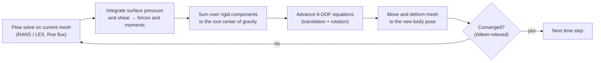
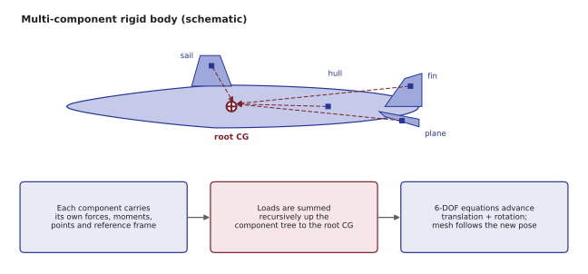
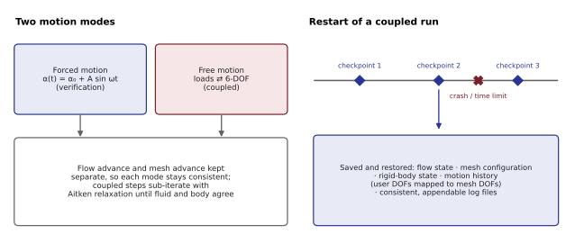
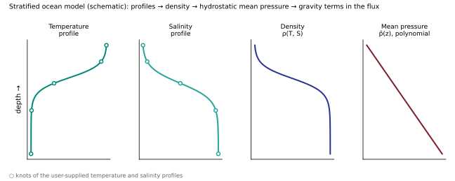
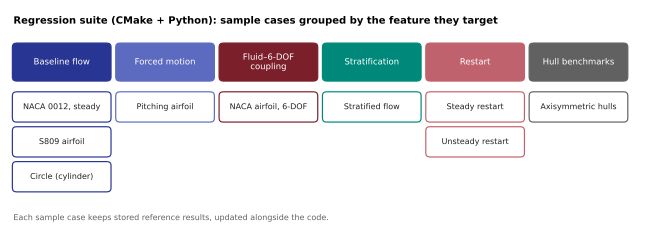
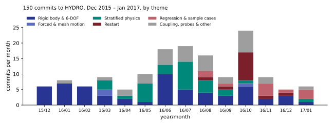
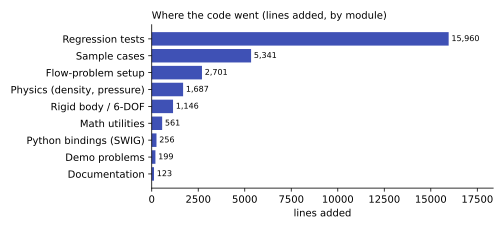

# Submarine Maneuvering: Fluid–6-DOF Coupling

!!! abstract "In one minute"
    - **Problem.** Predicting how a submarine responds to its own maneuvers means solving the
      flow and the rigid-body motion *together*: the hull moves, the mesh moves, the loads change.
    - **What I built.** The fluid–6-DOF rigid-body coupling in HYDRO, a US Navy CFD code: a
      multi-component rigid-body system, forced and free motion, stable sub-iteration between
      flow and body, stratified-ocean physics, restart, and the regression-test suite that
      guarded all of it.
    - **Result.** A verified parallel C++/MPI capability for submarine maneuvering simulation,
      run on the ONR cluster at ~5k CPUs, delivered for the US Navy.

## My role

Research Scientist at CMSoft (2015–2017), a small company developing HYDRO for the US Navy. I extended my CFD work from rotors to underwater vehicles. I owned the
rigid-body dynamics, its coupling to the flow solver, restart, and the regression framework,
alongside the core HYDRO developers on a large C++ codebase.

!!! note "About this page"
    HYDRO is a US Navy code. This page describes the work in general terms only. The diagrams
    are schematics drawn for this site and contain no project geometry, data or source code. The
    charts summarize my own commit history (counts only).

## How the coupling works

Each physical time step alternates between the fluid and the body until the two agree:

## What I implemented

### Multi-component rigid body

Bodies are built from multiple components (hull and appendages), each carrying its own forces,
moments, points and reference frame. External loads are summed recursively up the component
tree to the root center of gravity, which drives the 6-DOF equations.

<figure markdown>

<figcaption>Schematic drawn for this site: generic shapes, no project geometry.</figcaption>
</figure>

### Forced and free motion, stable coupling, restart

- **Forced and free motion.** Prescribed maneuvers (for example pitching) for verification, and
  fully coupled free motion. Flow advance and mesh advance are kept separate, so each mode stays
  consistent.
- **Stable coupling.** Sub-iterations with Aitken relaxation, so the fluid–body exchange
  converges without very small time steps.
- **Restart.** Full restart of coupled runs, including the rigid-body state and the motion
  history mapped to mesh degrees of freedom, with log files kept consistent across a crash. On a
  shared cluster, long maneuvers depend on it.

<figure markdown>

<figcaption>Schematic drawn for this site.</figcaption>
</figure>

### Stratified ocean

Submarines operate in layered water. I implemented the stratified-flow physics:

- density models built from user-supplied **temperature and salinity profiles**, defined by
  knots, with handling for missing profiles
- a polynomial **hydrostatic mean-pressure profile** (p̄) consistent with the chosen density model
- **gravity terms in the flux computation**

<figure markdown>

<figcaption>Schematic: illustrative curve shapes, not data.</figcaption>
</figure>

### Probes, regression tests and sample cases

- **Probes.** Point and surface probes (parallelogram and conical surfaces) that output flow
  quantities and displacements at a chosen frequency, including for the steady solver.
- **Regression suite.** CMake + Python tests over the sample cases I added, each with stored
  reference results updated alongside the code.

<figure markdown>

<figcaption>Case names as committed; grouped by the feature each targets.</figcaption>
</figure>

## My contributions in numbers

From my own commit history in HYDRO (counts only; no code or data):
**150 commits** (plus merges) from December 2015 to January 2017, adding about **28,000 lines**,
most of them tests, sample cases, physics and the rigid-body system.

<figure markdown>

<figcaption>Commits per month, classified by commit message. Stratified physics peaked in mid-2016, restart in October 2016, regression and rigid-body components in late 2016.</figcaption>
</figure>
<figure markdown>

<figcaption>Lines added by top-level module.</figcaption>
</figure>

## Verification and validation

Modules were checked first against classical fluid-dynamics problems with known answers, then
against submarine-specific cases. The same philosophy runs through my later work: the
[ERF regression tests](erf-exascale.md) and the evaluation stage of
[MLAP](../ai-ml/surrogate-modeling.md).

**Why it matters for the roles I target:** this is multi-physics coupling (fluid + structure
dynamics) in production-grade scientific C++, the building block of a digital twin of a
maneuvering vehicle. The same partitioned-coupling logic applies to aircraft stores separation,
rotor–fuselage interaction and fluid–structure interaction.

## Stack

C++MPIRANS / LES6-DOF dynamicsMesh motionUnstructured AMRCGNSParMETISCMake / ConanPythonSWIGPointwisePBS

## Related

- [Wings and rotors](wings-rotors.md): the aerodynamics background this work built on
- [Skills matrix](../skills.md)
