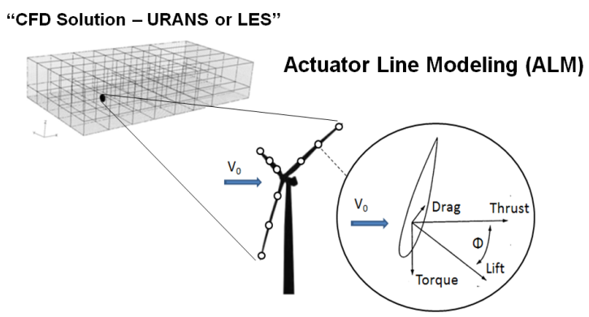
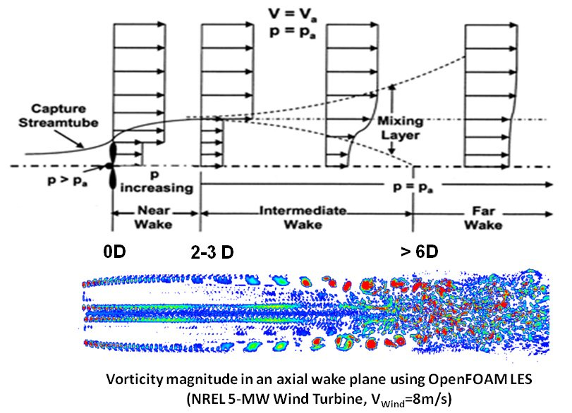
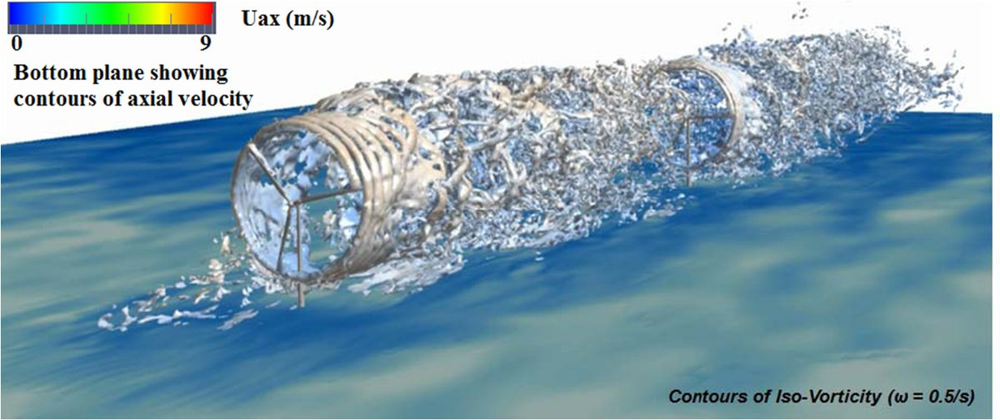
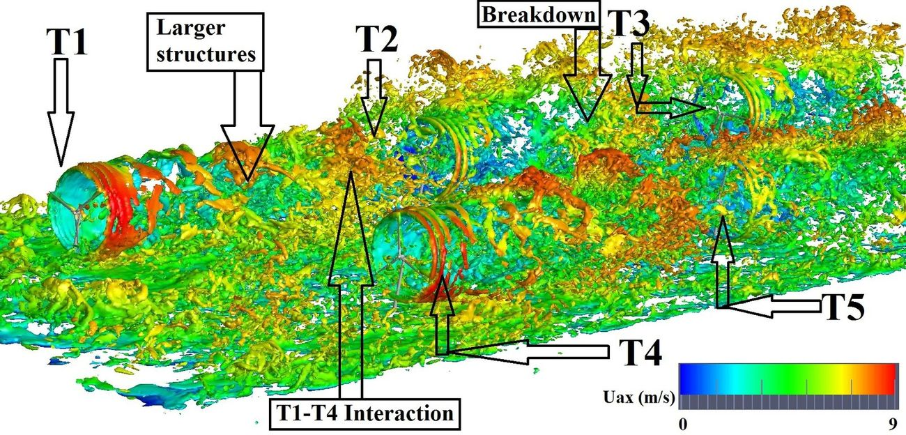

# Wings and Rotors in Atmospheric Turbulence

!!! abstract "In one minute"
    - **Problem.** Blade-resolved CFD of a wind farm or rotorcraft wake is far too expensive,
      but cheaper blade models got tip loads and wake structure wrong.
    - **What I built.** Geometry-based blade models (the actuator line with an elliptic force
      projection, then the **actuator curve embedding**, ACE) in an OpenFOAM LES solver, plus
      statistical tools to study how blades respond to atmospheric turbulence.
    - **Result.** Modeling guidelines that became a reference for the field: 199 citations for
      the 2014 guidelines paper, 86 for the JFM ACE paper, used by groups in Belgium, Israel,
      Denmark and the US, and by the US Navy for ship-airwake pilot training.

## My role

PhD research at Penn State (advisor Sven Schmitz), in collaboration with NREL's National Wind
Technology Center (Matthew Churchfield, Patrick Moriarty). I developed the models, implemented
them in C++ inside OpenFOAM, ran the LES campaigns on Titan (~4k CPUs), and did the statistical
analysis. Later at Envision Digital I applied the same models to production wind-resource
assessment.

## The modeling problem

The **actuator line model** (ALM) represents each blade as a line of points carrying lift and
drag from airfoil tables. The forces are smeared into the flow as body forces with a Gaussian
kernel of width \(\varepsilon\):

\[
\eta_\varepsilon(r) = \frac{1}{\varepsilon^3 \pi^{3/2}} \exp\!\left[-\left(\frac{r}{\varepsilon}\right)^2\right]
\]

The choice of \(\varepsilon\) controls everything: too small is unstable on an LES grid, too
large smears the tip vortex and over-predicts tip loads.

<figure markdown>
{ width="560" }
<figcaption>Actuator line modeling: blade forces from airfoil data are projected onto the CFD
grid. From Jha et al., <a href="https://doi.org/10.3390/en8076468">Energies 8 (2015)</a>,
CC BY 4.0.</figcaption>
</figure>

**Contributions, in order:**

1. **Guidelines for the projection** ([JSEE 2014][doi-jsee-2014]). A projection radius that
   varies along the span following an **elliptic distribution**, with rules for choosing
   \(\varepsilon\) on isotropic LES grids. Tested on the NREL Phase VI rotor and the NREL 5-MW
   turbine against measurements and the blade-element code XTURB-PSU.
2. **Accuracy assessment** ([AIAA 2013][doi-aiaa-2013]). How state-of-the-art ALM variants
   compare on wake prediction.
3. **Actuator curve embedding** ([JFM 2018][doi-jfm-2018]). Represents *arbitrary* lifting
   curves (swept, curved, tip-shaped blades), and removes the force overlap and projection
   beyond the tip that make ALM inconsistent. Demonstrated on an elliptic wing, the NREL Phase VI
   rotor (parked and rotating) and the NREL 5-MW turbine.
4. **Rotorcraft** ([AHS 2013][pdf-ahs-2013]). The same framework for helicopter and tiltrotor
   wakes.

## Wakes, loads and turbulence

With the models in place I asked how atmospheric turbulence and upstream wakes drive the loads
and power of downstream turbines.

<figure markdown>
{ width="640" }
<figcaption>Wake regions behind a turbine and the LES vorticity field that resolves them (NREL
5-MW, 8 m/s). Jha et al., <a href="https://doi.org/10.3390/en8076468">Energies 2015</a>,
CC BY 4.0.</figcaption>
</figure>

- **Turbulence transport in a wind farm** ([Energies 2015][doi-energies-2015]). Two NREL 5-MW
  turbines seven diameters apart in neutral and unstable atmospheric boundary layers, and a
  five-turbine staggered farm. Power spectral densities of turbine power reveal the space and time
  scales of atmospheric turbulence. High-resolution surface extracts show how turbulence
  transport recovers the wake's momentum deficit.
- **Blade-load unsteadiness** ([JSEE 2016][doi-jsee-2016]). ALM parameters cause notable
  uncertainty in predicted power, and it comes from the **outer 15% of the span**. Unsteady
  aerodynamics, by contrast, dominates **inboard**.
- **Fluid–structure interaction** ([AIAA 2014][doi-aiaa-2014-fsi]). Actuator line coupled
  tightly to a finite-element structural solver.
- **Icing** ([AIAA 2012][doi-aiaa-2012]). TIOCS, a strip-theory model of ice accretion and
  aerodynamics with control strategies that mitigate lost performance.

<figure markdown>

<figcaption>Turbine–turbine interaction in atmospheric turbulence: iso-vorticity with axial
velocity on the ground plane. Jha et al., <a href="https://doi.org/10.3390/en8076468">Energies
2015</a>, CC BY 4.0.</figcaption>
</figure>

<figure markdown>

<figcaption>Five NREL 5-MW turbines in unstable atmospheric flow: larger structures, wake breakdown
and the T1–T4 interaction. This dataset (10 TB of CFD output) was featured by Intelligent Light
in <a href="https://drive.google.com/file/d/1aIxq1njxseOAJoyEFwiIlRnyrGQVjPgG/view">Aerospace
America, June 2015</a>. Jha et al., <a href="https://doi.org/10.3390/en8076468">Energies
2015</a>, CC BY 4.0.</figcaption>
</figure>

## Who uses it

- **Research.** UCLouvain (actuator disk tip-loss correction; mollified lifting lines, *AIAA J.*
  2018, *TCFD* 2020), Technion (LES/ALM for rotor noise and its control, AIAA SciTech 2020,
  *Aerosp. Sci. Tech.* 2021), UT Dallas (tower and nacelle effects, *Wind Energy* 2017), DTU
  (tip modeling), floating-turbine wakes (Yang et al. 2023), and the *Handbook of Wind Energy
  Aerodynamics* (2022).
- **Industry and government.** CRAFT Tech used the models in US Navy-funded simulation for
  naval pilot training ([Forsythe et al., US Navy/Boeing][pdf-forsythe]). Envision Energy uses
  them in its in-house wind-farm code.

[Compiled evidence of researcher implementations (PDF folder)][drive-impact-researchers]

## Later: from the rotor to the weather

At LLNL the question grew from one rotor to the whole atmosphere: how to drive wind-farm LES
with real mesoscale weather. That led to DOE's multi-lab coupling study
([WES 2023][doi-wes-2023]) and to [ERF](erf-exascale.md). The
[AlphaVentus repo][alphaventus-repo] holds my post-processing for a WRF-LES
generalized-actuator-disk study of the Alpha Ventus offshore farm.

## Stack

C++OpenFOAMMPILESRANS / DESBEMTXFOILPointwiseFieldViewMATLABTitanStatistics / PSD

## Links

| What | Paper | PDF |
|---|---|---|
| ALM guidelines, *J. Sol. Energy Eng.* 136 (2014) | [DOI][doi-jsee-2014] | [Drive][pdf-jsee-2014] |
| Actuator curve embedding, *J. Fluid Mech.* 834 (2018) | [DOI][doi-jfm-2018] | [Drive][pdf-jfm-2018] |
| Turbulence transport in a wind farm, *Energies* 8 (2015) | [DOI][doi-energies-2015] | [Drive][pdf-energies-2015] |
| Blade-load unsteadiness, *J. Sol. Energy Eng.* 138 (2016) | [DOI][doi-jsee-2016] | [Drive][pdf-jsee-2016] |
| Accuracy of ALM, AIAA ASM 2013 | [DOI][doi-aiaa-2013] | |
| Rotorcraft and wind-turbine wakes, AHS Forum 69 (2013) | | [Drive][pdf-ahs-2013] |
| Turbulence transport in wakes, AHS Forum 70 (2014) | | [Drive][pdf-ahs-2014] |
| Turbines under icing, AIAA ASM 2012 | [DOI][doi-aiaa-2012] | [Drive][pdf-aiaa-2012] |

All papers: [Wings & Rotors folder][drive-wings-rotors] · [Google Scholar][scholar]
